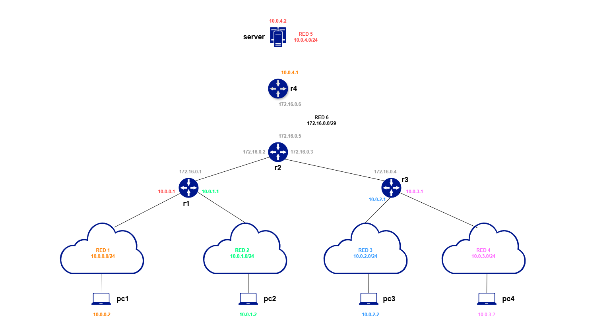

# Introducción.
La red que se pretende crear está formada por 9 dispositivos virtuales, 4 pcs en redes diferentes, 4 routers y un servidor, el esquema es el siguiente:
<br><br>

# Hipervisores, KVM y Libvirt.
Un hipervisor, también conocido como monitor de máquinas virtuales (VMM, en inglés Virtual Machine Monitor) es un software que permite crear y ejecutar varias máquinas virtuales dentro de un único hardware, así como diferentes sistemas operativos. Actúa como una capa de abstracción entre el hardware y los sistemas operativos, asignando y gestionando los recursos físicos (CPU, memoria, almacenamiento, red) entre las diferentes VM de manera eficiente. Los hipervisores se encargan de separar los recursos de la máquina virtual del sistema de hardware y de distribuirlos adecuadamente.

## Tipos de hipervisores.
### Hipervisores de tipo 1 o hipervisores bare-metal.
Los hipervisores de tipo 1 o bare-metal, también conocidos como hipervisores nativos, se instalan directamente sobre el hardware del servidor y gestionan el sistema o sistemas operativos invitados. Este tipo de hipervisor es el que se suele desplegar para necesidades de computación de centros de datos. Por lo general ofrecen un rendimiento mejor y más eficiente que los hipervisores alojados. Del mismo modo que ofrecen mayor seguridad, al estar aislados del OS, que suele ser más propenso a sufrir ataques. Algunos ejemplos son VMware ESXi, Proxmox, Xen, KVM, etc.
### Hipervisores de tipo 2 o hipervisores alojados.
Los hipervisores de tipo 2 o hipervisores alojados se ejecutan como una capa de software por encima del sistema operativo de la host machine. Esto quiere decir que se ejecutan sobre un sistema operativo anfitrión (como si fueran un programa más). Se usan para abstraer los sistemas operativos invitados del OS principal y son más fáciles de instalar y usar, pero menos eficientes porque dependen del sistema operativo anfitrión. VMWare, VirtualBox, Parallels Desktop , etc.

Para este trabajo se va a usar KVM que convierte el kernel de Linux en un hipervisor de tipo 1 ya que se ejecuta con privilegios de bajo nivel similares al hardware. Algunos consideran que al ejecutarse sobre un sistema operativo como es Ubuntu se consideraría de tipo 2 con comportamiento de tipo 1.

# Requisitos, sistema operativo.
Antes de comenzar el trabajo es necesario comprobar que se cumplen los requisitos mínimos funcionales del equipo anfitrión que alojará todos los datos. Mínimo 8GB de RAM, pero esto es muy justito, recomendable 16GB y cuantas más mejor, Una CPU de mínimo 6 núcleos potentes con soporte de tecnologías de virtualización como VT-x/AMD-V, unos 40GB libres en disco, red compatible con bridges y redes virtuales y Ubuntu 22.04 en adelante y por último es importante no olvidar instalar libvirt, KVM y expect.
```bash
sudo apt update
sudo apt install qemu-kvm libvirt-daemon-system libvirt-clients bridge-utils virt-manager
sudo apt install expect
```
Verificamos la instalación:
```bash
kvm-ok
```
En caso de que kvm-ok no esté instalado, se puede usar `egrep -c '(vmx|svm)' /proc/cpuinfo` para verificar soporte de virtualización.
Para comprobar que libvirt funciona correctamente y visualizar todas las máquinas virtuales se puede usar lo siguiente.
```bash
sudo systemctl status libvirtd
```
```bash
virsh list --all
```

## Punto de partida.
El objetivo es automatizar completamente la configuración de la infraestructura virtual. Para ello, se define la ruta base del proyecto como `/home/alumno/practicaRed`, donde se almacenarán todos los archivos necesarios: la plantilla XML (`plantilla-vm.xml`), la imagen base (`agr-vm-base.qcow2`) y los scripts (`script1.py`, `script2.py`, `scriptPrincipal.sh` y `limpieza.sh`).

Para simplificar el contenido de los ficheros antes de comenzar con los scripts se concedieron permisos completos a todos los usuarios del sistema, se cambió el propietario a libvirt-qemu para que las VMs gestionadas por libvirt/KVM puedan acceder a los archivos .qcow2, XML, etc:
```bash
sudo chmod -R 777 /home/alumno/practicaRed
sudo chown -R libvirt-qemu:kvm /home/alumno/practicaRed
sudo chmod 666 /home/alumno/practicaRed
```
Evidentemente lo anterior es inseguro, este enfoque es útil para pruebas en entornos controlados, pero no es recomendable en producción. Una alternativa es aplicar permisos específicos sólo a los archivos necesarios.
Es muy probable que para cada equipo anfitrión o sistema operativo haga falta alguna configuración diferente de permisos o añadirla.
Una vez completados estos pasos, basta con acceder a la terminal, situarse en la ruta base y ejecutar `scriptPrincipal.sh `.

# Plan.
Libvirt permite gestionar máquinas virtuales mediante archivos XML que definen tanto las redes virtuales como las propias máquinas virtuales según su rol. Estos XML son muy importantes en el proyecto, ya que describen la configuración de los dispositivos virtuales (los pcs, routers y servidor) y su conectividad. Se hace uso del comando virsh para crear, definir y eliminar tanto redes como máquinas virtuales a partir de dichos archivos.
Los conceptos y puntos que se han usado en este proyecto son los siguientes.
1. Cada red virtual (red1 a red6) actúa como un switch virtual aislado: los dispositivos conectados a la misma red pueden comunicarse entre sí, pero están completamente aislados de otras redes y del host anfirtrión.
2. Bridges virtuales.
- un bridge (puente de red) es un componente que conecta una red virtual con una red física u otras redes virtuales, permitiendo que las máquinas virtuales (VMs) se comuniquen entre sí o con el exterior como si compartieran una red física.
- Funcionan en la capa 2 (enlace de datos) del modelo OSI, actuando como Switches virtuales inteligentes que reenvían tramas basándose en direcciones MAC.
- **virbr0**: es el bridge NAT por defecto.
- **Bridges de red**: cada red virtual tiene su propio bridge interno.
- Cada red virtual definida tiene su **propio bridge interno**, aislado del resto.
- Los routers y demás máquinas se conectan a estos bridges a través de interfaces virtuales.

3. OSPF y FRR.
OSPF (Open Shortest Path First) es un protocolo de enrutamiento dinámico que permite que los routers se descubran automáticamente, se intercambien las tablas de routing y encuentren el mejor camino entre redes.
FRR (Free Range Routing)es un software de enrutamiento que incorpora diversos protocolos entre ellos OSPF para gestionar el tráfico de red en Linux y Unix. La shell o interfaz de comandos que usa FRR para la configuración de dispositivos es vtysh, que es similar a la que usa Cisco IOS.
4. Diagram del concepto de la arquitectura de conexión con bridges.
```bash
PC1 -----> [Bridge red1] -----> Router R1 (eth1)
                                Router R1 (eth3) -----> [Bridge red6(troncal)] -----> Router R2
```

# Script limpieza.sh.
Con el script principal se van a crear carpetas, fichero y configuraciones que se podrán borrar con [`limpieza.sh`](scripts/limpieza.sh). El propio script está bastante documentado y explicado, su única función es eliminar todo rastro que haya dejado la ejecución de [`scriptPrincipal.sh`](scripts/scriptPrincipal.sh).

# script1.py.
Este [`script`](scripts/script1.py) en Python sirve para crear archivos de configuración XML que describen redes virtuales para ser usadas en KVM. Se necesitan 6 redes, por ello se van a crear esos 6 XML con la configuración necesaria en cada una. La librerías que se usan son "os" para manejar rutas de archivos y carpetas y "xml.etree.ElementTree" para modificar y trabajar con documentos XML.

1. Función crear_red_xml(...).
- Crea los datos necesarios para configurar redes virtuales, que en este caso van a ser 6.
- Los argumentos que recibe son el nombre de la red, la dirección IP de red, la netmask y un número de bridge opcional que si es None se genera automáticamente.
- La función define el nombre de la red (red1, red2, ...), el nombre del bridge virtual (virbr1, virbr2,...), añade la IP y la máscara de red y define una rango de direcciones DHCP.
- La troncal red6 tendrá una máscara de red /29 porque no se necesitan más de 6 direcciones IP para las interfaces de los routers.
2. Función main(...).
- Define la ruta base.
- Define la lista de las 6 redes a crear.
- Crea la carpeta si aún no existe.
- Recorre la lista de redes y llama a la función crear_red_xml(...) para construir el XML y guardarlo como "red{X}.xml".

Se obtendrán 6 archivos .xml con las redes definidas, que se van a usar posteriormente para crear las redes virtuales con virsh. 
Ejemplo de cómo quedaría red1:
<br><br>

# script2.py.
Este script actúa como una "fábrica de máquinas virtuales", ya que automatiza todo el proceso de creación y configuración de múltiples VMs.

1. Preparación de cada máquina:
- Crea una carpeta específica para cada VM (pc1, pc2, server, r1, etc.)
- Copia la imagen base `agr-vm-base.qcow2` y la renombra para cada máquina según corresponda.
- Carga la plantilla XML y la personaliza para cada VM.

2. Configuración de red según el tipo:
- Para los PCs:
Cada PC se conecta automáticamente a su red correspondiente como se ve en el esquema, pc1 con red1, pc2 con red2, etc.
- Para el servidor:
Se conecta a la red5 y también se le añade una conexión NAT, importante para que tenga salida a internet.
- Para los routers:
Cada router se conecta a múltiples redes dependiendo de dónde se ubique, por ejemplo, r1 se conecta a red6, red2 y red1 (actúa como puente entre las redes 1, 2 y 6), r2 se conecta tres veces a red6 porque es el router intermedio.
Todos los routers también tienen acceso a internet vía NAT para poder descargar el Software Routing Suite (FRR) que ayudará a que se enrute el tráfico.

3. Resultado final:
- Genera 9 archivos XML listos para usar con libvirt.
- Cada VM tiene su carpeta con imagen de disco y su XML.

Tras ejecutar [`script1.py`](scripts/script1.py) y [`script2.py`](scripts/script2.py) se obtienen XML con todas las redes creadas y las carpetas con los dispositivos virtuales y con su respectivos nombres como aparece en la siguiente imagen:
<br><br>

# scriptPrincipal.sh
El principal manejador del proyecto, es el código que controla todo el proceso automatizándolo y completando toda la configuración con tan solo ejecutar:
```bash
sudo bash scriptPrincipal.sh
``` 

Explicación resumida de las funciones que hace el código.
1. Preparación inicial.
- Ejecuta los otros dos scripts `script1.py` y `script2.py` para generar los XMLs.
- Define y arranca todas las redes virtuales (sudo virsh net-define..., sudo virsh net-start...).
- Define todas las máquinas virtuales en libvirt (sudo virsh define...).

2. Configuración de IPS.
- A los PCs se les asigna su dirección IP terminada en .2 y a los routers varias IPs para sus diferentes interfaces y así poder conectar las diferentes redes.
- Al servidor se le asigna la dirección 10.0.4.2 más una dirección IP para NAT y conectarse a internet (192.168.122.10).

3. Configuración automática.
- Se arrancan todas las máquinas y se conecta a cada una de ellas usando expect.
- En los routers se instala FRRy se configura OSPF .
- En los PCs y servidor se aplica la configuración de red con netplan, para facilitar esto se crea la carpeta network_configs donde se guardan las configuraciones para cada host y donde principalmente se automatiza la configuración del archivo 50-cloud-init.yaml de cada MV.

4. Configuración específica en cada router.
- r1: es el router que conecta la red1 con al red2 y la red troncal (172.16.0.x).
- r2: interconecta todos los routers entre sí.
- r3: conecta la red3 con la red4 y la red troncal.
- r4: conecta la red del servidor con r2.

5. Servidor web.
- Aqui se puede configurar un servidor web que va a ser accesible desde cualquier PC e incluso desde la máquina virtual anfitriona, no se ha configurado por simplificación del proyecto pero hay muchas alternativas usando Apache, Nginx, etc.

Como es de esperar, ejecutar esto tarda unos minutos pero se obtendrá toda una infraestructura completa de redes dentro de una sola máquina física. Se pueden agregar firewalls, VLANs, simular tráfico con ping, acceder y restringir tráfico hacia ciertos hosts, etc. Esto es muy común para replicar entornos de desarrollo.

# Resultado final.

Aqui se mostrarán capturas de las pruebas que se han realizado.
- Al ejecutar "sudo bash scriptPrincipal.sh" se puede comprobar cómo se van creando las carpetas y ficheros junto con mensajes informativos del proceso.
<br><br>
<br><br>
- Finaliza el proceso:
<br><br>
- Proceso automático de configuración de FRR en r1.
<br><br>
- Configuración de netplan r1 que tiene 5 interfaces, 1 para salir a internet con NAT, 3 para las demás redes y 1 para loop.
<br><br>
- Ping de PC1 a interfaz de r1.
<br><br>
- Configuración de red del servidor y ping a interfaz de r2.
<br><br>
- Configuración de red de PC2 y ping a PC1.
<br><br>
- Configuración de red de PC4 y ping al servidor.
<br><br>
- Configuración de red de PC1 y ping a PC4.
<br><br>
- ping desde el ordenador anfitrión (el físico) al servidor.
<br><br>
- Configuración de red de PC3 y ping a PC1.
<br><br>

# Referencias y bibliografía.
- [Hipervisores](https://www.stackscale.com/es/blog/hipervisores/#Que_es_un_hipervisor)
- [Bridges](https://vasexperts.com/es/resources/glossary/bridge/#:~:text=Un%20puente%20de%20red%20o,filtrar%20la%20carga%20de%20tr%C3%A1fico.).
- [vtysh documentation](https://docs.frrouting.org/projects/dev-guide/en/latest/vtysh.html).
- [netplan](https://www.ochobitshacenunbyte.com/2021/04/26/netplan-configurar-la-red-en-ubuntu-20-04/)
- [yaml](https://netplan.readthedocs.io/en/stable/netplan-yaml/).
- [xml.etree.ElementTree](https://docs.python.org/3/library/xml.etree.elementtree.html).
- [kvm libvirt](https://www.cherryservers.com/blog/install-kvm-ubuntu).
- [QEMU/KVM](https://www.pinguytaz.net/index.php/2021/08/13/usando-qemu-kvm-con-libvirt-3-x-redes-virtuales/)
- Suppi Boldrito, Remo. (2022). Virtualización e hipervisores. 
- Apuntes Universidad Politénica de Madrid (2025).
- [Libvirt-Network-XML-format](https://libvirt.org/formatnetwork.html)
